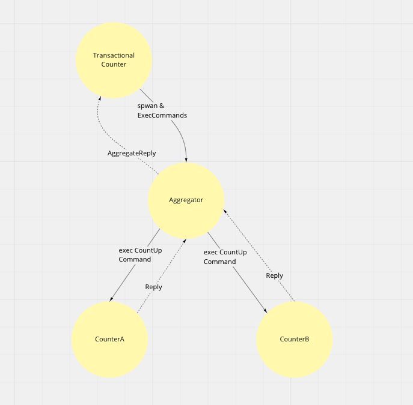

# akka-actor-interaction-samples

## Two count-ups to keep data consistent
- If both count-ups succeed, return success.
- If both count-ups are failures, give a failure response.
- If one of the count-ups fails, retry up to the specified number of times.
- If it does not succeed after retrying a specified number of times, it returns failure and retries when it is executed again.

